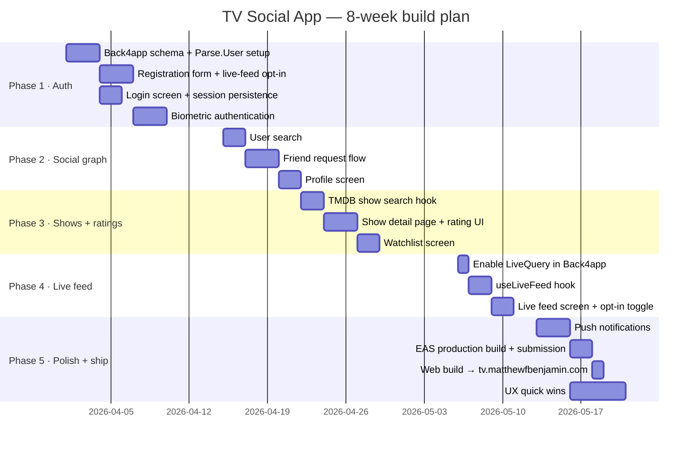
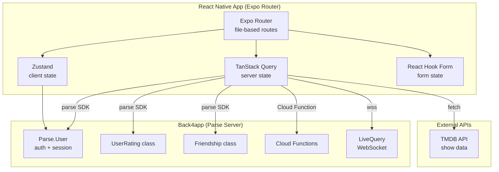
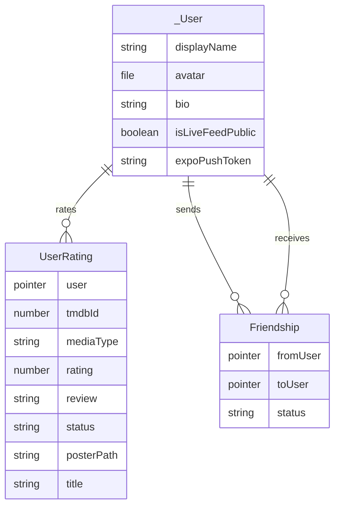
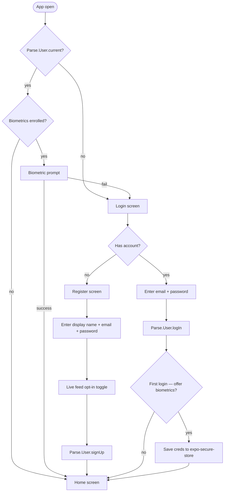

# TV Social App — Dev Plan

A full 8-week plan for building the TV tracking social app using Expo Router, Back4app (Parse), and TMDB.

---

## Timeline overview



---

## App architecture



---

## Parse data schema



---

## Auth + onboarding flow



---

## Phase 1 — Auth + onboarding

**Timeline:** Week 1–2

### Task 1 — Back4app schema + Parse.User setup

Create these classes in the Back4app dashboard:

**`_User` (built-in fields — do not recreate)**

Parse automatically provides these on every `_User` object. You cannot delete them:
- `objectId` — String
- `username` — String (we will set this to the user's email)
- `email` — String
- `password` — String
- `emailVerified` — Boolean
- `authData` — Object
- `ACL` — ACL
- `createdAt` — Date
- `updatedAt` — Date

**`_User` custom fields to add in the Back4app dashboard**
- `displayName` — String (enforce uniqueness in the dashboard — this is the user-facing name)
- `avatar` — File (Parse.File stored on Back4app cloud storage)
- `bio` — String
- `isLiveFeedPublic` — Boolean (default: `false`)
- `expoPushToken` — String

> **Note on username vs email:** Parse requires `username` to be unique. By setting `username` equal to `email` at sign-up, you get uniqueness enforcement for free and users only ever type their email — they never need to invent a separate username. `displayName` is the human-facing name shown in the UI and is also enforced as unique via a `beforeSave` Cloud Function (see below).

**`UserRating`**
- `user` — Pointer → `_User`
- `tmdbId` — Number
- `mediaType` — String (`"tv"` or `"movie"`)
- `rating` — Number (1–5)
- `review` — String
- `status` — String (`"want_to_watch"` | `"watching"` | `"watched"` | `"dropped"`)
- `posterPath` — String
- `title` — String

**`Friendship`**
- `fromUser` — Pointer → `_User`
- `toUser` — Pointer → `_User`
- `status` — String (`"pending"` | `"accepted"`)

ACL Cloud Function for `UserRating`, and `displayName` uniqueness enforcement for `_User`:

```js
Parse.Cloud.beforeSave('UserRating', req => {
  const acl = new Parse.ACL();
  acl.setPublicReadAccess(true);
  acl.setWriteAccess(req.user, true);
  req.object.setACL(acl);
});

// Enforce unique displayName on _User
Parse.Cloud.beforeSave(Parse.User, async req => {
  if (!req.object.dirtyKeys().includes('displayName')) return;
  const displayName = req.object.get('displayName');
  if (!displayName) throw new Parse.Error(
    Parse.Error.VALIDATION_ERROR, 'displayName is required');
  const existing = await new Parse.Query(Parse.User)
    .equalTo('displayName', displayName)
    .notEqualTo('objectId', req.object.id ?? '')
    .first({ useMasterKey: true });
  if (existing) throw new Parse.Error(
    Parse.Error.USERNAME_TAKEN, 'That display name is already taken');
});
```

### Task 2 — Registration form with live-feed opt-in

> **UX note:** Ask the live-feed question last, after the user has committed to signing up. Frame it as a feature ("Join the live feed — let friends see what you're watching in real time"), not a consent checkbox.

Fields in order: display name → email → password → avatar (optional) → live feed toggle.

> **Note:** There is no separate "username" field shown to the user. `username` is set silently to the email value so Parse's uniqueness constraint handles duplicate email prevention automatically.

Install the image picker dependency first:

```bash
pnpm add react-native-image-picker
cd ios && pod install && cd ..
```

Also add the following key to `ios/Info.plist` to allow photo library access:

```xml
<key>NSPhotoLibraryUsageDescription</key>
<string>TV Social needs access to your photos to set a profile picture.</string>
```

```ts
// app/(auth)/register.tsx
import { launchImageLibrary } from 'react-native-image-picker';

// Pick avatar from device photo library
const pickAvatar = async (): Promise<Parse.File | null> => {
  return new Promise(resolve => {
    launchImageLibrary(
      { mediaType: 'photo', includeBase64: true, maxWidth: 400, maxHeight: 400 },
      response => {
        const asset = response.assets?.[0];
        if (!asset?.base64 || !asset?.fileName) return resolve(null);
        const file = new Parse.File(asset.fileName, { base64: asset.base64 });
        resolve(file);
      }
    );
  });
};

const onSubmit = async (data: RegisterForm) => {
  const user = new Parse.User();
  // Set username = email so Parse enforces email uniqueness
  user.set('username', data.email);
  user.set('email', data.email);
  user.set('password', data.password);
  user.set('displayName', data.displayName);
  user.set('isLiveFeedPublic', data.joinLiveFeed);

  if (data.avatarFile) {
    // Save the ParseFile first, then attach it to the user
    await data.avatarFile.save();
    user.set('avatar', data.avatarFile);
  }

  await user.signUp();
  useAuthStore.getState().setUser(user);
  router.replace('/(tabs)/home');
};
```

To display the avatar anywhere in the app, call `.url()` on the `ParseFile`:

```ts
const avatarUrl = user.get('avatar')?.url();
// Pass to expo-image: <Image source={{ uri: avatarUrl }} />
```

### Task 3 — Login screen + session persistence

Parse stores the session token in `AsyncStorage` automatically. On app boot, check for an existing session:

```ts
// src/app/_layout.tsx
useEffect(() => {
  const current = Parse.User.current();
  if (current) {
    useAuthStore.getState().setUser(current);
    router.replace('/(tabs)/home');
  } else {
    router.replace('/(auth)/login');
  }
}, []);
```

### Task 4 — Biometric authentication

Install:

```bash
pnpm add expo-local-authentication expo-secure-store
```

Strategy — store credentials securely on first login, replay on subsequent opens:

```ts
// On first successful login: save credentials
await SecureStore.setItemAsync(
  'userCredentials',
  JSON.stringify({ email, password })
);

// On subsequent app opens: prompt biometrics
const result = await LocalAuthentication.authenticateAsync({
  promptMessage: 'Unlock TV Social',
  fallbackLabel: 'Use password',
});
if (result.success) {
  const creds = JSON.parse(
    await SecureStore.getItemAsync('userCredentials')
  );
  await Parse.User.logIn(creds.email, creds.password);
}
```

> **UX note:** Only offer biometrics after the user has successfully logged in once. Present it as "Enable Face ID for faster sign-in?" on the home screen, not during onboarding.

---

## Phase 2 — Social graph

**Timeline:** Week 3

### Task 1 — User search

Lives at `(tabs)/search.tsx`. Use a single search bar with a segmented control to toggle between user search and show search.

```ts
// hooks/useUserSearch.ts
export function useUserSearch(q: string) {
  return useQuery({
    queryKey: ['users', q],
    queryFn: async () => {
      if (!q || q.length < 2) return [];
      const query = new Parse.Query(Parse.User);
      query.contains('displayName', q, { caseInsensitive: true });
      query.limit(20);
      return query.find();
    },
    enabled: q.length >= 2,
  });
}
```

### Task 2 — Friend request flow

Paste into Back4app Cloud Code:

```js
Parse.Cloud.define('sendFriendRequest', async (req) => {
  const { toUserId } = req.params;
  const toUser = await new Parse.Query(Parse.User)
    .get(toUserId, { useMasterKey: true });
  const existing = await new Parse.Query('Friendship')
    .equalTo('fromUser', req.user)
    .equalTo('toUser', toUser).first();
  if (existing) throw 'Already sent';
  const f = new Parse.Object('Friendship');
  f.set('fromUser', req.user);
  f.set('toUser', toUser);
  f.set('status', 'pending');
  const acl = new Parse.ACL();
  acl.setReadAccess(req.user, true);
  acl.setReadAccess(toUser, true);
  acl.setWriteAccess(req.user, true);
  acl.setWriteAccess(toUser, true);
  f.setACL(acl);
  return f.save(null, { useMasterKey: true });
});

Parse.Cloud.define('acceptFriendRequest', async (req) => {
  const { friendshipId } = req.params;
  const f = await new Parse.Query('Friendship')
    .get(friendshipId, { useMasterKey: true });
  f.set('status', 'accepted');
  return f.save(null, { useMasterKey: true });
});
```

### Task 3 — Profile screen

Route: `(tabs)/profile/[userId].tsx` — works for own profile and others'.

- Own profile: edit button, settings (including live-feed toggle)
- Others' profiles: friend status + their ratings (if friends)

Sections: avatar + display name · friend count · ratings grid · friend button · live feed badge.

---

## Phase 3 — Shows + ratings

**Timeline:** Week 4–5

### Task 1 — TMDB show search hooks

```ts
// hooks/useShowSearch.ts
export function useShowSearch(query: string) {
  return useQuery({
    queryKey: ['shows', 'search', query],
    queryFn: () => tmdbFetch('/search/multi', {
      query,
      include_adult: 'false',
    }),
    enabled: query.length >= 2,
    staleTime: 1000 * 60 * 5,
  });
}

// hooks/useShowDetails.ts
export function useShowDetails(id: number, type: 'tv' | 'movie') {
  return useQuery({
    queryKey: ['show', type, id],
    queryFn: () => tmdbFetch(`/${type}/${id}`, {
      append_to_response: 'credits,videos,similar',
    }),
    staleTime: 1000 * 60 * 60, // 1 hour
  });
}
```

### Task 2 — Show detail page + rating UI

Route: `app/show/[type]/[id].tsx`

> **UX note:** The rating UI should be a large tap-friendly 5-star row — it's the most important interaction in the app. After rating, immediately save to Parse and invalidate the live feed query.

```ts
const rateMutation = useMutation({
  mutationFn: async (stars: number) => {
    const existing = await new Parse.Query('UserRating')
      .equalTo('user', Parse.User.current())
      .equalTo('tmdbId', show.id)
      .first();
    const obj = existing ?? new Parse.Object('UserRating');
    obj.set('user', Parse.User.current());
    obj.set('tmdbId', show.id);
    obj.set('mediaType', type);
    obj.set('rating', stars);
    obj.set('posterPath', show.poster_path);
    obj.set('title', show.name ?? show.title);
    return obj.save();
  },
  onSuccess: () => {
    queryClient.invalidateQueries({ queryKey: ['feed'] });
    queryClient.invalidateQueries({ queryKey: ['profile'] });
  },
});
```

### Task 3 — Watchlist

Add a `status` field to `UserRating`: `'watching' | 'watched' | 'want_to_watch' | 'dropped'`.

The Watchlist tab (`(tabs)/watchlist.tsx`) filters by status. A quick-add button on ShowCards adds to "want to watch" in one tap.

---

## Phase 4 — Live activity feed

**Timeline:** Week 6

### Task 1 — Enable LiveQuery in Back4app

In the Back4app dashboard: **Server Settings → Server URL → enable LiveQuery** and add `UserRating` to the LiveQuery classes list.

```ts
// Add to src/lib/parse.ts
Parse.liveQueryServerURL = 'wss://YOUR_APP.back4app.io';
```

### Task 2 — useLiveFeed hook

```ts
// hooks/useLiveFeed.ts
export function useLiveFeed() {
  const [items, setItems] = useState([]);

  useEffect(() => {
    // Only query ratings from public users
    const userQ = new Parse.Query(Parse.User);
    userQ.equalTo('isLiveFeedPublic', true);

    const query = new Parse.Query('UserRating');
    query.matchesQuery('user', userQ);
    query.include('user');
    query.descending('createdAt');
    query.limit(50);

    // Initial fetch
    query.find().then(setItems);

    // Live subscription
    let sub;
    query.subscribe().then(s => {
      sub = s;
      s.on('create', item =>
        setItems(prev => [item, ...prev].slice(0, 100)));
      s.on('update', item =>
        setItems(prev => prev.map(p => p.id === item.id ? item : p)));
    });

    return () => sub?.unsubscribe();
  }, []);

  return items;
}
```

### Task 3 — Live feed screen + opt-in toggle

Route: `(tabs)/activity.tsx`

- Feed is a `FlashList` of `FeedItem` components
- New items slide in from the top via Reanimated
- Opt-in toggle in the header top-right: a single switch labeled "Share my activity"

```ts
const toggleFeed = async (val: boolean) => {
  const user = Parse.User.current();
  user.set('isLiveFeedPublic', val);
  await user.save();
  useAuthStore.getState().setUser(user);
};
```

---

## Phase 5 — Polish + ship

**Timeline:** Week 7–8

### Task 1 — Push notifications

```bash
pnpm add expo-notifications expo-device
```

Register the Expo push token on login, save to `_User.expoPushToken`. Trigger notifications from Back4app Cloud Code `afterSave` hooks on `Friendship` and `UserRating`.

### Task 2 — EAS production build + App Store submission

```bash
# Build for both platforms
eas build --platform all --profile production

# Submit to stores
eas submit --platform ios
eas submit --platform android

# OTA update (no store review needed)
eas update --branch production --message "fix: live feed timing"
```

### Task 3 — Web build → tv.matthewfbenjamin.com

```bash
# Export static web build
npx expo export --platform web

# Deploy to Vercel
npx vercel --prod

# Add CNAME in your DNS:
# tv.matthewfbenjamin.com → cname.vercel-dns.com
```

Set TMDB and Back4app keys as environment variables in the Vercel project dashboard — never in the repo.

### Task 4 — UX quick wins before launch

```bash
pnpm add expo-haptics
```

- Haptic feedback on every star tap
- Skeleton loaders instead of spinners
- Empty state illustrations on watchlist and feed
- Pull-to-refresh on the activity feed
- Optimistic UI on rating (update the star immediately, sync in background)
- Expo Splash Screen configured
- Deep links working (`show/tv/1396` → Breaking Bad detail page)

```ts
// In StarRating.tsx
import * as Haptics from 'expo-haptics';

onPress={() => {
  Haptics.impactAsync(Haptics.ImpactFeedbackStyle.Light);
  onRate(star);
}}
```

---

## File structure

```
tv-social-app/
├── src/
│   ├── app/
│   │   ├── _layout.tsx          # Root layout (providers + session check)
│   │   ├── index.tsx            # Redirect → /home or /auth
│   │   ├── (auth)/
│   │   │   ├── _layout.tsx
│   │   │   ├── login.tsx
│   │   │   └── register.tsx
│   │   ├── (tabs)/
│   │   │   ├── _layout.tsx      # Bottom tab navigator
│   │   │   ├── home.tsx         # Trending / discover
│   │   │   ├── search.tsx       # Show + user search
│   │   │   ├── watchlist.tsx
│   │   │   ├── activity.tsx     # Live feed
│   │   │   └── profile/
│   │   │       └── [userId].tsx
│   │   └── show/
│   │       └── [type]/
│   │           └── [id].tsx     # Show detail + rating
│   ├── components/
│   │   ├── ui/                  # Button, Input, Skeleton, etc.
│   │   ├── shows/               # ShowCard, StarRating
│   │   └── social/              # FeedItem, FriendButton
│   ├── lib/
│   │   ├── parse.ts             # Parse SDK init
│   │   └── tmdb.ts              # TMDB base fetch client
│   ├── hooks/
│   │   ├── useTrending.ts
│   │   ├── useShowSearch.ts
│   │   ├── useShowDetails.ts
│   │   ├── useUserSearch.ts
│   │   ├── useLiveFeed.ts
│   │   ├── useWatchlist.ts
│   │   └── useBiometricAuth.ts
│   ├── store/
│   │   ├── authStore.ts         # Zustand: session + user
│   │   └── uiStore.ts           # Zustand: UI preferences
│   └── types/
│       ├── tmdb.ts
│       └── parse.ts
├── .env.local                   # TMDB_API_KEY, B4A_APP_ID, B4A_JS_KEY
├── app.config.ts
├── tailwind.config.js
├── eas.json
└── tsconfig.json
```

---

*Generated with Claude · tv-social-app · matthewfbenjamin.com*
